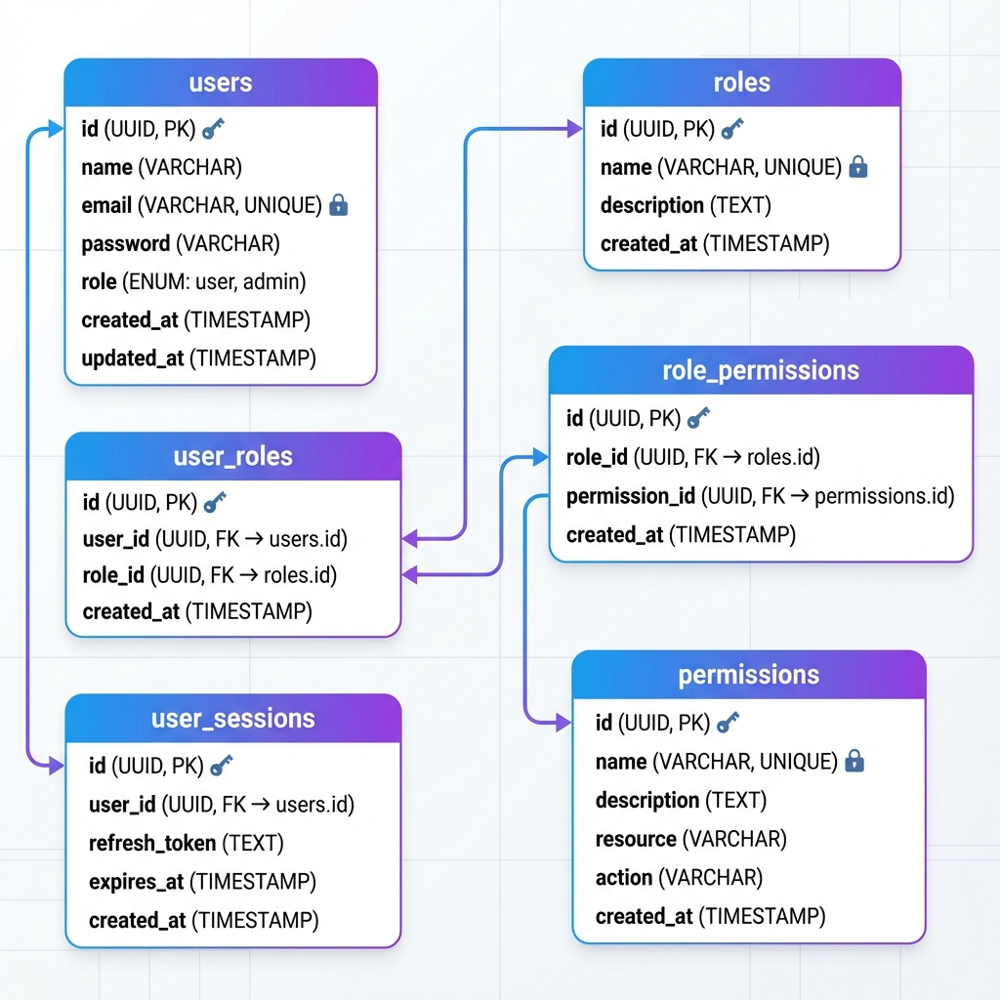
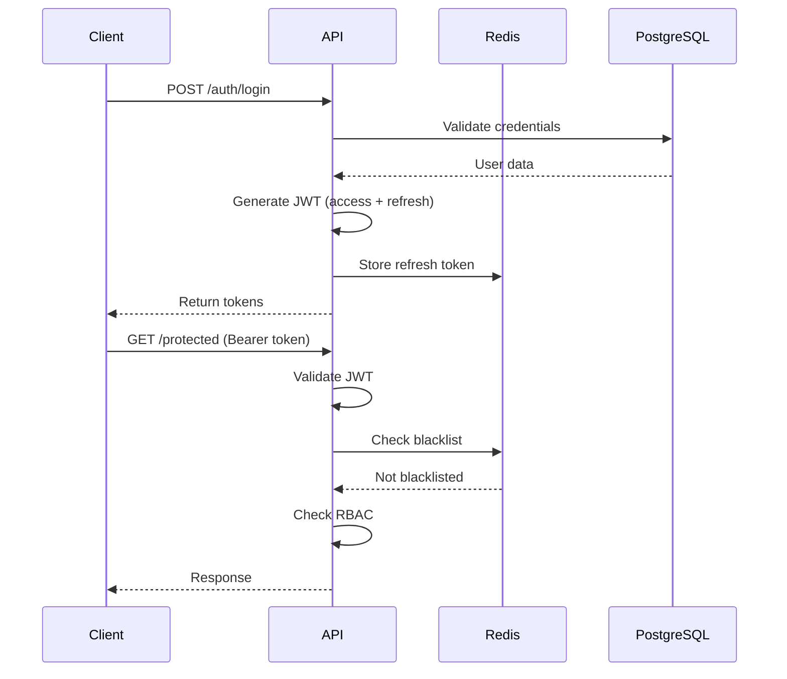

# Go Fiber Boilerplate - Architecture & Documentation

## 🗄️ Database Schema



### Tables Overview

| Table | Description |
|-------|-------------|
| `users` | User accounts with email/password |
| `user_sessions` | Refresh token storage |
| `roles` | Role definitions (super_admin, user, etc.) |
| `permissions` | Permission definitions (resource:action) |
| `user_roles` | Many-to-many: users ↔ roles |
| `role_permissions` | Many-to-many: roles ↔ permissions |

---

## 🔐 Authentication Flow


### Token Lifecycle



---

## 🏗️ System Architecture


### Layer Structure

```
┌─────────────────────────────────────────────────┐
│                   CLIENT                        │
│         (Browser, Mobile, API Client)           │
└─────────────────────┬───────────────────────────┘
                      │
┌─────────────────────▼───────────────────────────┐
│              MIDDLEWARE STACK                   │
│  ┌─────────┬─────────┬─────────┬─────────┐      │
│  │ Recover │ Logger  │  CORS   │ Helmet  │      │
│  ├─────────┼─────────┼─────────┼─────────┤      │
│  │RateLimit│  ETag   │Compress │RequestID│      │
│  └─────────┴─────────┴─────────┴─────────┘      │
└─────────────────────┬───────────────────────────┘
                      │
┌─────────────────────▼───────────────────────────┐
│            AUTH & RBAC MIDDLEWARE               │
│  ┌───────────────────────────────────────┐      │
│  │   JWT Validation → Blacklist Check    │      │
│  │   → Role Check → Permission Check     │      │
│  └───────────────────────────────────────┘      │
└─────────────────────┬───────────────────────────┘
                      │
┌─────────────────────▼───────────────────────────┐
│              BUSINESS LAYER                     │
│  ┌──────────┐  ┌──────────┐  ┌──────────┐       │
│  │   Auth   │  │   RBAC   │  │  (More)  │       │
│  │ UseCase  │  │ UseCase  │  │ UseCases │       │
│  └────┬─────┘  └────┬─────┘  └────┬─────┘       │
└───────┼─────────────┼─────────────┼─────────────┘
        │             │             │
┌───────▼─────────────▼─────────────▼─────────────┐
│              REPOSITORY LAYER                   │
│  ┌──────────────────────────────────────┐       │
│  │         Cache Helper (Redis)         │       │
│  │              ↓ miss ↓                │       │
│  │         PostgreSQL Queries           │       │
│  └──────────────────────────────────────┘       │
└─────────────────────┬───────────────────────────┘
                      │
        ┌─────────────┴─────────────┐
        ▼                           ▼
┌──────────────┐           ┌──────────────┐
│  PostgreSQL  │           │    Redis     │
│   (Data)     │           │   (Cache)    │
└──────────────┘           └──────────────┘
```

---

## 📁 Project Structure

```
├── cmd/server/          # Application entry point
├── internal/
│   ├── config/          # Configuration
│   ├── database/        # DB & Redis connections
│   ├── middleware/      # Auth, RBAC, logging
│   ├── module/
│   │   ├── auth/        # Authentication module
│   │   └── rbac/        # Role-based access control
│   └── pkg/             # Shared utilities
├── docs/                # Swagger & diagrams
├── http/                # HTTP test files
└── migrations/          # Database migrations
```

---

## 🔑 RBAC System

### Default Roles

| Role | Description | Access Level |
|------|-------------|--------------|
| `super_admin` | Full system access | All endpoints |
| `user` | Standard user | User endpoints only |

### Permission Format

```
resource:action
```

Examples:
- `users:read` - View users
- `users:write` - Create/update users
- `roles:read` - View roles
- `roles:write` - Create/update roles
