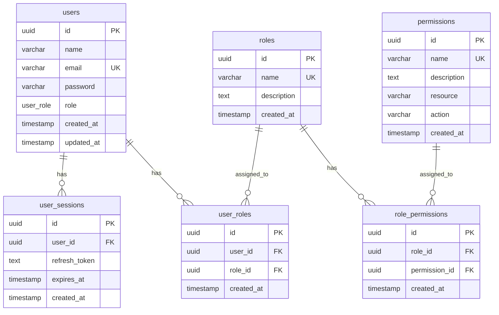

# Database Schema

## Entity Relationship Diagram



## Tables Detail

### users
Primary user table with authentication credentials.

| Column | Type | Constraints |
|--------|------|-------------|
| id | UUID | PRIMARY KEY, DEFAULT gen_random_uuid() |
| name | VARCHAR(255) | NOT NULL |
| email | VARCHAR(255) | UNIQUE, NOT NULL |
| password | VARCHAR(255) | NOT NULL (bcrypt hashed) |
| role | user_role | DEFAULT 'user' |
| created_at | TIMESTAMP | DEFAULT NOW() |
| updated_at | TIMESTAMP | DEFAULT NOW(), auto-update trigger |

### roles
Role definitions for RBAC system.

| Column | Type | Constraints |
|--------|------|-------------|
| id | UUID | PRIMARY KEY, DEFAULT gen_random_uuid() |
| name | VARCHAR(100) | UNIQUE, NOT NULL |
| description | TEXT | |
| created_at | TIMESTAMP | DEFAULT NOW() |

### permissions
Permission definitions with resource:action format.

| Column | Type | Constraints |
|--------|------|-------------|
| id | UUID | PRIMARY KEY, DEFAULT gen_random_uuid() |
| name | VARCHAR(100) | UNIQUE, NOT NULL |
| description | TEXT | |
| resource | VARCHAR(50) | NOT NULL |
| action | VARCHAR(50) | NOT NULL |
| created_at | TIMESTAMP | DEFAULT NOW() |

### user_roles
Junction table for user-role assignments.

| Column | Type | Constraints |
|--------|------|-------------|
| id | UUID | PRIMARY KEY, DEFAULT gen_random_uuid() |
| user_id | UUID | FK → users(id) ON DELETE CASCADE |
| role_id | UUID | FK → roles(id) ON DELETE CASCADE |
| created_at | TIMESTAMP | DEFAULT NOW() |
| | | UNIQUE(user_id, role_id) |

### role_permissions
Junction table for role-permission assignments.

| Column | Type | Constraints |
|--------|------|-------------|
| id | UUID | PRIMARY KEY, DEFAULT gen_random_uuid() |
| role_id | UUID | FK → roles(id) ON DELETE CASCADE |
| permission_id | UUID | FK → permissions(id) ON DELETE CASCADE |
| created_at | TIMESTAMP | DEFAULT NOW() |
| | | UNIQUE(role_id, permission_id) |

## Indexes

```sql
-- User lookups
CREATE INDEX idx_users_email ON users(email);

-- Role lookups
CREATE INDEX idx_roles_name ON roles(name);
CREATE INDEX idx_user_roles_user_id ON user_roles(user_id);
CREATE INDEX idx_user_roles_role_id ON user_roles(role_id);

-- Permission lookups
CREATE INDEX idx_permissions_name ON permissions(name);
CREATE INDEX idx_role_permissions_role_id ON role_permissions(role_id);
```

## Default Data

### Roles
- `super_admin` - Full system access
- `user` - Standard user access

### Permissions
- `users:read`, `users:write`, `users:delete`
- `roles:read`, `roles:write`, `roles:delete`
- `permissions:read`
- `profile:read`, `profile:write`
